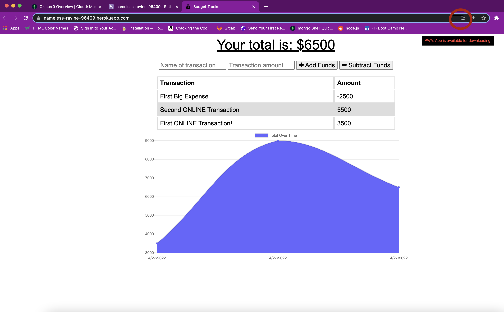

# ubiquitous-garbanzo-budget-tracker
# Budget Tracker
  
  
  ## Table of Contents ##
  *[Description](#description)

  *[License](#license)

  *[Languages](#languages)

  *[Installation](#installation)

  *[Usage](#usage)

  *[Contributing](#contributing)

  *[Questions](#questions)

  ## Description ##
  An applicatino designed for users to be able to keep track of their budget. Transactions including adding and removing funds. It allows the user to keep an eye on their finances and perhaps notice patterns they may or may not need to change. It allows for offline usage, meaning their data is temporarily cached in the server. Once they regain internet connectivity the imformation is then posted and updated on the website! The application is also available to be downloaded to their device, computer and mobile!
  

  ## License ##
  This is licensed under MIT
  

  ## Installation ##
  npm i

  ## Tests ##
  npm test

  ## Usage ##
  Make sure everything is properly set up and installed.. there's code in here!

  ## Contributing ##
  Just that there's code in here.

  ## Questions ##
  Github: [DEIVRS60](https://github.com/DEIVRS60)

  Email: david.reyes095@gmail.com
